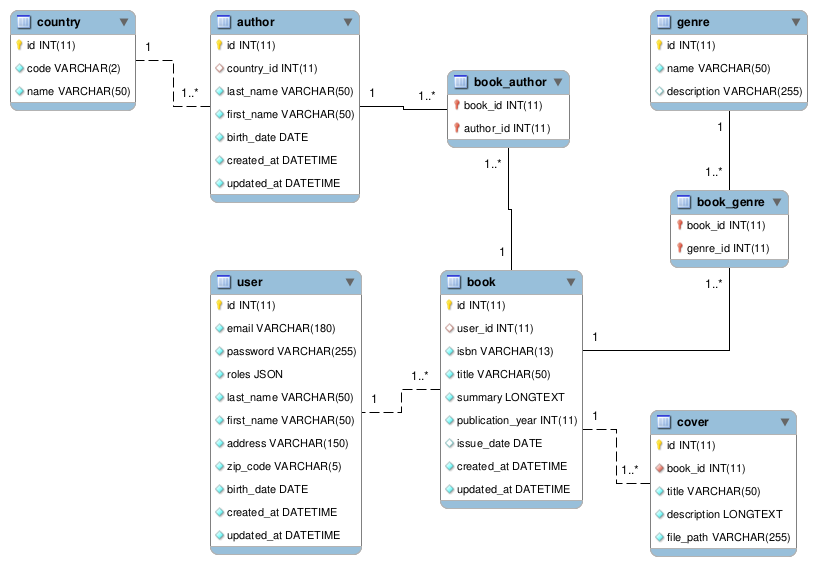

# Symfony - EFREI - Examen

## Base de données



## Éléments pré-installés

- Toutes les entités ont déjà été créées via la commande `m̀ake:entity`
- L'intégralité des opérations universelles (CRUD) a également été générée pour chaque entité via la commande `m̀ake:crud`

## Installation du projet

### 1 - Récupération du projet

Dans un terminal :
```shell
git clone git@github.com:El-Profesor/EFREI-Municipal-Library.git <nom_de_dossier>
```

**Note :** `<nom_de_dossier>` doit être remplacé par le nom choisi (ex. : `municipal_library`).

### 2 - Installation des dépendances

Dans un terminal, depuis le dossier `<nom_de_dossier>` :
```shell
composer install
```

**Note :** si besoin, choisir les options proposées par défaut.

### 3 - Configuration de l'environnement

- Faire une copie du fichier `.env` en le nommant `.env.local` 
- Configurer dans le fichier `.env.local` les paramètres de connexion à la base de données en prenant soin de **vérifier** au préalable le **type de serveur** de votre environnement (**MySQL** ou **MariaDB**)

**Note :** pour des questions de cohérence, il est souhaitable de nommer la base de données `municipal_library`.

### 4 - Création de la base de données

Dans un terminal :
```shell
php bin/console doctrine:database:drop --force --if-exists
php bin/console doctrine:database:create
php bin/console doctrine:schema:create 
```

### 5 - Insertion d'un jeu de données en base de données

Dans un terminal :
```shell
php bin/console doctrine:fixtures:load
```

### 6 - Vérification du bon fonctionnement de l'application

Dans un terminal :
```shell
symfony server:start
```

Dans un navigateur, consulter l'URL : [http://localhost:8000/book/](http://localhost:8000/book/).