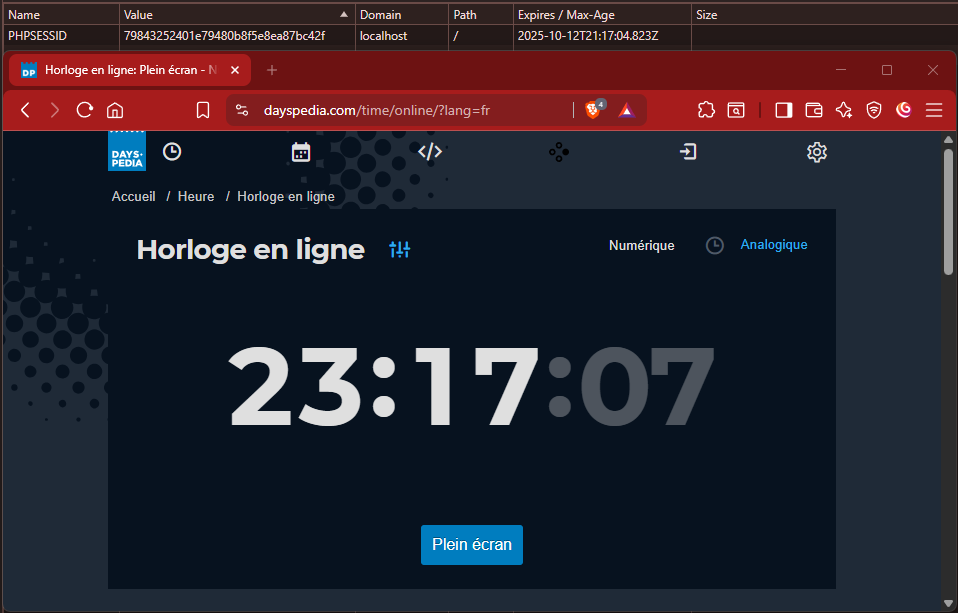
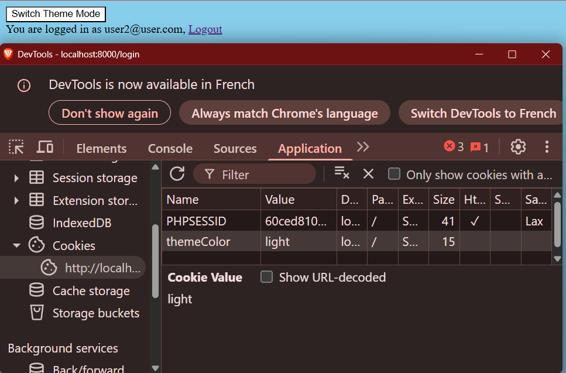
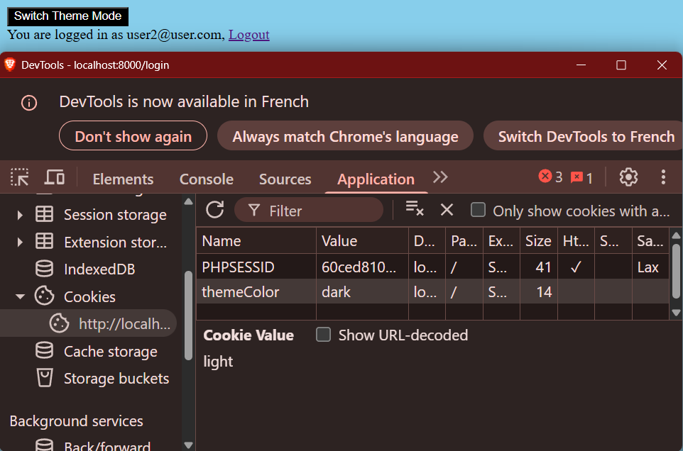

# Sécurisation de l’application *« Bibliothèque »*

## Authentification 48h
Lors d'une connexion le 10/10/2025 à 23h17 (heure française UTC+2), le cookie de session à pour date d'expiration le 12/10/2025 à 21h17 (UTC) donc cela donc 23h17 en heure française UTC+2.  
L'authentification est donc valide durant 48h


## *Cookie* du mode affichage
Lors d'un clic sur le bouton "Switch Theme Mode", le cookie de couleur du theme change de light à dark et inversement




## Protection CSRF


## Vulnérabilités des dépendances
Deux commande native sont disponibles pour vérifier les vulnérabilités présentes dans les dépendances
```bash
symfony check:security
```
ou
```bash
composer audit
```
Sur les dépots GitHub, il est possible de configurer Dependabot pour alerter en cas de vulnérabilité dans les dépendances et propose de mise à jour de celle ci.

## Difficultés rencontrées et solutions
Mise en place CSP. Hésitation entre l'utilisation d'un package externe ou par listener

## Bilan des acquis
Bilan des acquis/découverte avec l'utilisation de Symfony :

- Validation de l’intégralité des entrées
- Stratégie de sécurité du contenu (CSP)
- Personnalisation des pages d'erreurs pour les codes de statut de réponse HTTP (401 : Utilisateur non authentifié / 403 : Accès refusé / 404 : Ressource non trouvée / 405 : Méthode non autorisée.
- Mise en place d'un cookie simulant la sauvegarde du choix d’un mode d’affichage (clair/sombre)
- Trouver une solution permettant de tester les vulnérabilités potentielles

## Remarques complémentaires
À compléter, si besoin.  
